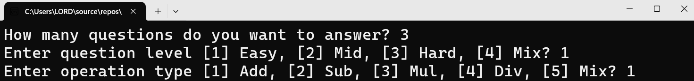
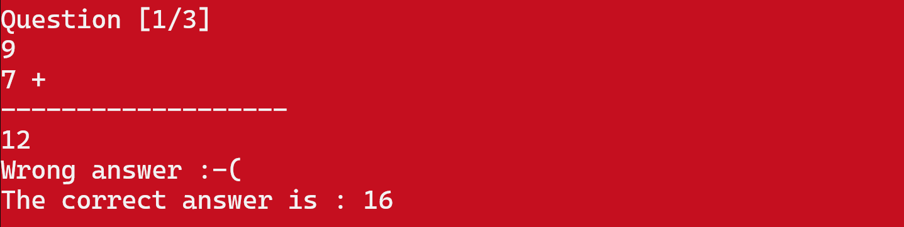
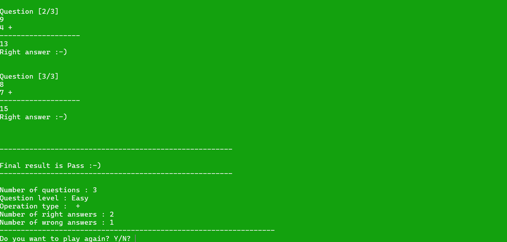

Math Quiz Game (C++ Console Application)

A console-based Math Quiz Game built using C++.

This project was developed to practice core programming fundamentals including structured programming, enums, structs, modular design, and problem-solving logic.

Features

    Multiple difficulty levels:

        Easy

        Mid

        Hard

        Mixed level

    Multiple operation types:

        Addition

        Subtraction

        Multiplication

        Division

        Mixed operations

Random question generation

Input validation

Score tracking

Pass/Fail evaluation

Clean modular design using functions

Technologies Used:

    C++

    Console Application

    Structured Programming

    Enums & Structs

    Random number generation

What I Practiced in This Project:

    Designing structured data using struct

    Using enum for better readability and control

    Building reusable functions

    Separating logic into clear modules

    Implementing game flow control

    Handling user input validation

How the Game Works:

    The player chooses:

        Number of questions

        Difficulty level

        Operation type

    The program generates random math questions.

    The player answers each question.

    The program:

        Checks answers

        Tracks correct and wrong answers

        Displays final result (Pass/Fail)

How to Run:

    Open the project in Visual Studio (or any C++ compiler).

    Build the project.

    Run the program.

    Follow the on-screen instructions.

Project Purpose:

This project was created as part of strengthening my C++ programming fundamentals and improving logical thinking and code organization skills.

### Start Screen

### Wrong Question Example

### Right And Final Result

Developed by: Mariam Ayman
